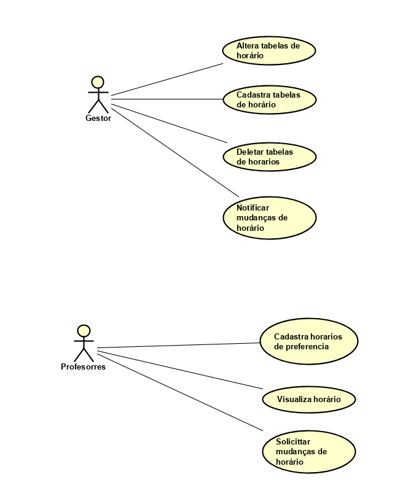

# Documento de visão
# O'Time
## Introdução
### Resumo

`O O'Time é uma aplicação web que permite a gestão e montagem de horários de forma eficiente e simples.`

### Escopo

Principais responsabilidades e não responsabilidades do sistema.

### Responsabilidades

- Permitir que os usuários se cadastrem no sistema e tenham níveis de acesso diferentes de acordo com as preferências de um usuário principal.
- Permitir que os professores cadastrados possam enviar suas preferências de horário para a comissão de horários escolares.
- Notificar professores de eventuais mudanças no horário escolar.
- Garantir que não haja inconsistência nos dados.

### Não-responsabilidades

- Garantir acesso total no caso de perda de conexão com a internet.
- Permitir que os funcionários da escola conversem entre si.
- Segurança em caso de vazamento de senhas oriundo de descuido dos usuários.

## Requisitos

### Requisitos Funcionais

| Cod. | Nome | Descrição | Categoria |
| -------- | -------- | -------- | -------- |
| F01 | Cadastro de usuários |	O sistema deve permitir que os usuários se cadastrem no mesmo. |	Evidente |
| F02 | Login |	O sistema deve permitir que os usuários entrem no sistema usando suas credenciais. |	Evidente |
| F03 | Recuperação de senha |	O sistema deve permitir que os usuários recuperem suas senhas, se necessário. |	Evidente |

### Requisitos não funcionais

| Cod. | Nome | Descrição | Categoria | Obrigatoriedade| Permanência |
| -------- | -------- | -------- | -------- | -------- | -------- |
| NF01 | Interface Web |	Deve funcionar em uma plataforma web |	Interface | Obrigatório | Permanente |
| NF02 | Interface Mobile |	Deve funcionar em uma plataforma mobile |	Interface | Desejável | Transitório |
| NF03 | Tecnologias de Desenvolvimento |	Será desenvolvido usando o Play Framework na linguagem Java e HTML5 / JavaScript / CSS. |	Implementação | Obrigatório | Transitório |

### Tabela de Referência - Requisitos

| | NF01 | NF02 | NF03 |
| -------- | -------- | -------- | -------- |
| F01 |  | |  |
| F02 |  | |  |
| F03 |  | |  |

### Casos de uso

### Casos de Uso

| Cod. | Caso de Uso | Descrição | Classificação |
| -------- | -------- | -------- | -------- |
| UC01 | Cadastra tabelas de horário |	O gestor loga no sistema e escole cadastra tabelas. Abre-se então as tabela. | Primário |
| UC02 | Alterar tabela de horários| O gestor loga no sistema e escole alterar a tabela X. Abre-se então a tabela e ele pode editar clicando nas células. | Primário |
| UC03 | Deletar tabela de horários | O gestor loga no sistema e escole deletar a tabela X. Abre-se então uma mensagem de confirmação. | Secundário |
| UC04 | Notificar mundanças de horário | O gestor loga no sistema e escole notificação. Abre-se então as notificações. | Secundário |
| UC05 | Cadastra horários de preferencia | O Professor loga no sistema e cadastra horários de preferencia. Abre-se então a tabela e ele pode editar clicando nas células. | Secundário |
| UC06 | Visualiza horários | O Professor loga no sistema e escole visualiza horários. Abre-se então os horários cadastrados pelo o gesto e as suas preferencias do professor logado. | Secundário |
| UC07 | Solicita mudança de horário | O Professor loga no sistema e escole solicita mudança de horário. Abre-se então a tabela e ele seleciona a célula que deseja mudança. | Secundário |

### 2.6. Tabela de Referência - Casos de uso & Requisitos

| | NF01 | NF02 | NF03 | F01 | F02 | F03 |
| -------- | -------- | -------- | -------- | -------- | -------- | -------- |
| UC01 |  |  | | |  |  |