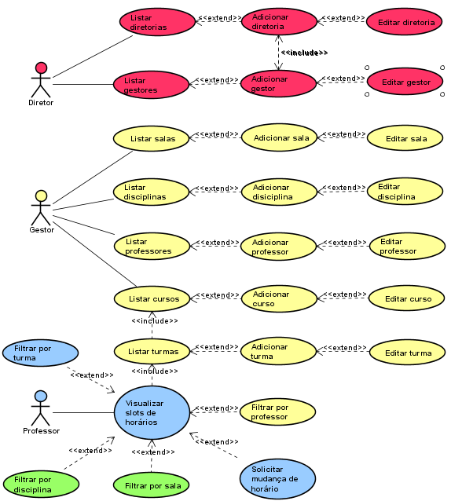

# Documento de visão
# O'Time
## 1. Introdução
### 1.1. Resumo

`O O'Time é uma aplicação web que permite a gestão e montagem de horários de forma eficiente e simples.`

### 1.3. Escopo

Principais responsabilidades e não responsabilidades do sistema.

### Responsabilidades

- Permitir que os usuários se cadastrem no sistema e tenham níveis de acesso diferentes de acordo com as preferências de um usuário principal.
- Garantir que não haja inconsistência nos dados.

### Não-responsabilidades

- Garantir acesso total no caso de perda de conexão com a internet.
- Permitir que os funcionários da escola conversem entre si.
- Segurança em caso de vazamento de senhas oriundo de descuido dos usuários.
- Criação automática de horários.

## 2. Requisitos

### 2.1. Requisitos Funcionais

| Cod | Nome | Descrição | Categoria |
| --- | ---- | --------- | --------- |
| F01 | Cadastro de usuários | O sistema deve permitir que os usuários se cadastrem no mesmo. | Evidente |
| F02 | Login |	O sistema deve permitir que os usuários entrem no sistema usando suas credenciais. | Evidente |
| F03 | Recuperação de senha | O sistema deve permitir que os usuários recuperem suas senhas, se necessário. | Evidente |
| F04 | Definir slots de horários | O sistema deve permitir que gestores definam slots de horários para as turmas cadastradas. | Evidente |
| F05 | Editar slots de horários | O sistema deve permitir que gestores alterem slots de horários já definidos, podendo excluí-los se necessário. | Evidente |
| F06 | Notificação de mudanças de horário | O sistema deve notificar aos usuários de mudanças nos horários. | Evidente |
| F07 | Cadastro de horários de disponibilidade | O sistema deve permitir o cadastro de horários de disponibilidade dos professores. | Evidente |
| F08 | Editar horários de disponibilidade | O sistema deve permitir a alteração de horários de disponibilidade dos professores, podendo excluí-los se necessário. | Evidente |
| F09 | Visualizar horários cadastrados | O sistema deve permitir aos gestores que visualizem os horários cadastrados por eles. | Evidente |
| F10 | Adicionar diretorias | O sistema deve permitir ao diretor adicionar diretorias. | Evidente |
| F11 | Solicitar mudança de horários | O sistema deve permitir aos professores solicitarem aos gestores mudanças de horários. | Evidente |
| F12 | Editar diretorias | O sistema deve permitir que o diretor altere as diretorias cadatradas, podendo excluí-las se necessário. | Evidente |
| F13 | Listar diretorias | O sistema deve permitir a listagem de diretorias cadastradas. | Evidente |
| F14 | Adicionar gestores | O sistema deve permitir ao diretor adicionar gestores. | Evidente |
| F15 | Editar gestores | O sistema deve permitir ao diretor alterar gestores cadastrados, podendo excluí-los se necessário. | Evidente |
| F16 | Listar gestores | O sistema deve permitir a listagem de gestores cadastrados. | Evidente |
| F17 | Adicionar salas | O sistema deve permitir ao diretor adicionar salas. | Evidente |
| F18 | Editar salas | O sistema deve permitir ao diretor alterar as salas cadastradas, podendo excluí-las se necessário. | Evidente | Evidente |
| F19 | Listar salas | O sistema deve permitir a listagem de salas cadastradas.| Evidente |
| F20 | Verificar disponibilidade das salas | O sistema deve permitir a verificação a disponibilidade das salas. | Evidente |
| F21 | Adicionar disciplinas | O sistema deve permitir ao gestor adicionar disciplinas.| Evidente |
| F22 | Editar disciplinas | O sistema deve permitir ao gestor alterar disciplinas cadastradas, podendo excluí-las se necessário. | Evidente |
| F23 | Listar disciplinas | O sistema deve permitir ao gestor a listagem de disciplinas cadastradas. | Evidente |
| F24 | Adicionar curso | O sistema deve permitir ao gestor adicionar cursos.| Evidente |
| F25 | Editar curso | O sistema deve permitir que ao gestor alterar cursos cadastrados, podendo excluí-los se necessário. | Evidente |
| F26 | Listar cursos | O sistema deve permitir a listagem de cursos cadastrados. | Evidente |
| F27 | Adicionar turma | O sistema deve permitir ao gestor adicionar turmas. | Evidente |
| F28 | Editar turma | O sistema deve permitir ao gestor alterar turmas cadastradas, podendo excluí-las se necessário. | Evidente |
| F29 | Listar turmas | O sistema deve permitir a listagem de turmas cadastradas. | Evidente |
| F30 | Definir slots de horário | O sistema deve permitir ao gestor definir os slots de horário de uma turma já cadastrada. | Evidente |
| F31 | Editar slots de horário | O sistema deve permitir ao gestor alterar os slots de horário de uma turma já cadastrada, podendo excluí-los se necessário. | Evidente |
| F32 | Visualizar slots de horário | O sistema deve permitir o professor visualizar slots de horário nos quais ele tem aula. | Evidente |
| F33 | Filtrar visualização de horários | O sistema deve permitir a filtragem da visualização dos slots de horários por sala, disciplina e turma. | Evidente |

### 2.2. Requisitos não funcionais

| Cód. | Nome | Descrição | Categoria | Obrigatoriedade | Permanência |
| ---- | ---- | --------- | --------- | --------------- | ----------- |
| NF01 | Interface Web | Deve funcionar em uma plataforma web | Interface | Obrigatório | Permanente |
| NF02 | Interface Mobile |	Deve funcionar em uma plataforma mobile | Interface | Desejável | Transitório |
| NF03 | Tecnologias de Desenvolvimento | Será desenvolvido usando o Django Framework na linguagem Python e HTML5 / JavaScript / CSS. | Implementação | Obrigatório | Transitório |
| NF04 | Restrição de horários | Permitir que apenas gestores modifiquem os horários | Implementação | Obrigatório | Transitório |
| NF05 | Exportação do arquivo de horários | O sistema deve permitir aos usuários exportar o arquivo de horários para outros formatos. | Especificação | Desejável | Transitório |
### 2.3. Diagrama Geral de Casos de uso



### 2.4. Casos de Uso

| Cod. | Caso de Uso | Descrição | Classificação |
| ---- | ----------- | --------- | ------------- |
| UC01 | Listar diretoria |O diretor loga no sistema e seleciona a opção 'Listar Diretorias'. Abre-se então a Lista de diretorias. | Secundário |
| UC02 | Adiciona diretoria | O diretor loga no sistema e seleciona a opção 'Listar Diretorias' e escolhe “Adiciona diretoria”. O sistema retorna uma tela de preenchimento de dados da diretoria. | Secundário |
| UC03 | Editar diretoria | O diretor loga no sistema e seleciona a opção 'Listar Diretorias' e selecionar a diretoria. O sistema retorna uma tela de edição de dados da diretoria. | Secundário |
| UC04 | Listar gestores | O diretor loga no sistema e seleciona a opção 'Listar Gestores'. Abre-se então a Lista de gestores. | Secundário |
| UC05 | Adiciona gestores | O diretor loga no sistema e seleciona a opção 'Listar Gestores' e escolhe “Adiciona gestor”. O sistema retorna uma tela de preenchimento de dados do gestor. | Secundário |
| UC06 | Editar gestores | O diretor loga no sistema e seleciona a opção 'Listar Gestores' e selecionar o gestor. O sistema retorna uma tela de edição de dados do gestor. | Secundário |
| UC07 | Listar salas | O gestor loga no sistema e seleciona a opção 'Listar Salas'. Abre-se então a Lista de salas. | Secundário |
| UC08 | Adiciona sala | O gestor loga no sistema e seleciona a opção 'Listar Salas' e escolhe “Adiciona Sala”. O sistema retorna uma tela de preenchimento de dados da sala.| Secundário |
| UC09 | Editar salas | O gestor loga no sistema e seleciona a opção 'Listar Salas' e selecionar a sala. O sistema retorna uma tela de edição de dados de salas. | Secundário |
| UC10 | Listar disciplinas | O gestor loga no sistema e seleciona a opção 'Listar Disciplinas'. Abre-se então a Lista de disciplinas. | Secundário |
| UC11 | Adiciona disciplinas | O gestor loga no sistema e seleciona a opção 'Listar Disciplinas' e escolhe “Adiciona Disciplina". O sistema retorna uma tela de preenchimento de dados da disciplina. | Secundário |
| UC12 | Editar disciplinas | O gestor loga no sistema e seleciona a opção 'Listar Disciplinas' e selecionar o disciplina. O sistema retorna uma tela de edição de dados da disciplina. | Secundário |
| UC13 | Listar Professores | O gestor loga no sistema e seleciona a opção 'Listar Professores'. Abre-se então a Lista de professores. | Secundário |
| UC14 | Adiciona Professores | O gestor loga no sistema e seleciona a opção 'Listar Professores' e escolhe “Adiciona professor". O sistema retorna uma tela de preenchimento de dados do professor. | Secundário |
| UC15 | Editar Professores | O gestor loga no sistema e seleciona a opção 'Listar Professores' e selecionar o professores. O sistema retorna uma tela de edição de dados de professores. | Secundário |
| UC16 | Listar Cursos | O gestor loga no sistema e seleciona a opção 'Listar Cursos'. Abre-se então a Lista de cursos. | Primário |
| UC17 | Adiciona Cursos | O gestor loga no sistema e seleciona a opção 'Listar Cursos' e escolhe “Adiciona curso". O sistema retorna uma tela de preenchimento de dados do curso. | Primário |
| UC18 | Editar Cursos | O gestor loga no sistema e seleciona a opção 'Listar Cursos' e selecionar o curso. O sistema retorna uma tela de edição de dados do curso. | Primário |
| UC19 | Listar Turmas | O gestor loga no sistema e seleciona a opção 'Listar Turmas'. Abre-se então a Lista de turmas. | Primário |
| UC20 | Adiciona Turmas | O gestor loga no sistema e seleciona a opção 'Listar Turmas' e escolhe “Adiciona turmas". O sistema retorna uma tela de preenchimento de dados do turmas.| Primário |
| UC21 | Editar Turmas | O gestor loga no sistema e seleciona a opção 'Listar Turmas' e selecionar a turma. O sistema retorna uma tela de edição de dados da turma. | Primário |
| UC22 | Visualizar slots de horário de uma turma | O gestor loga no sistema e seleciona a opção 'Lista de Horários das Turmas' e selecionar a turma. Abre-se então a tabela de horário da turma. | Primário |
| UC23 | Difinir slots de horário | O gestor loga no sistema e seleciona a opção 'Difinir slots de horário'. Abre-se então as tabelas. | Primário |
| UC24 | Editar slots de horário | O gestor loga no sistema e seleciona a opção 'Lista Horários das Turmas' e selecionar a turma. Abre-se então a tabela e ele pode editar clicando nas células. | Primário |
| UC25 | Visualizar Turmas | O professor loga no sistema e seleciona a opção 'Visualizar Turmas'. O sistema retorna uma tela com as turma. | Secundário |
| UC26 | Visualizar slots de horário | O professor loga no sistema e seleciona a opção 'Visualizar horário'. O sistema retorna uma tela com a tabela de slots de horário cadastrados. | Secundário |
| UC27 | Solicitar mudança de horário | O professor loga no sistema e seleciona a opção 'solicitar mudança de horário'. Abre-se então a tabela e ele seleciona a célula que deseja mudança. | Secundário |
| UC28 | Filtrar por disciplinas | O professor loga no sistema e seleciona a opção 'Visualizar horário'. O sistema retorna uma tela com a tabela de slots de horário cadastrados e seleciona a opção 'Filtrar por disciplinas'.O sistema retorna uma tela com a tabela de slots de horário filtrada por disciplina. | Secundário |
| UC29 | Filtrar por Sala | O professor loga no sistema e seleciona a opção 'Visualizar horário'. O sistema retorna uma tela com a tabela de slots de horário cadastrados e seleciona a opção 'Filtrar por Sala'.O sistema retorna uma tela com a tabela de slots de horário filtrada por sala. | Secundário |
| UC30 | Filtrar por Turma | O professor loga no sistema e seleciona a opção 'Visualizar horário'. O sistema retorna uma tela com a tabela de slots de horário cadastrados e seleciona a opção 'Filtrar por Turma'.O sistema retorna uma tela com a tabela de slots de horário filtrada por Turma. | Secundário |

### 2.5. Atores

| Ator | Descrição |
| ---- | --------- |
| Diretor | Responsável por cadastrar gestor e diretorias, se necessário. |
| Gestor | Responsável pela criação de tabelas de horários e mudanças nas mesmas, se necessário. | 
| Professor | Podem visualizar as tabelas de horários, solicitar mudanças aos gestores e selecionar horários de sua preferência. |

## 2.6. Clientes

```sh
O público-alvo do nosso sistema é formado principalmente por pessoas de instituições públicas,
que desejam adquirir um sistema que possibilite a gestão de horários de forma eficiente e simples.
```